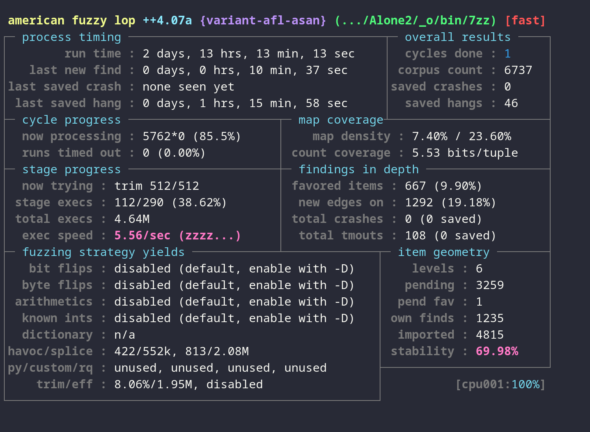
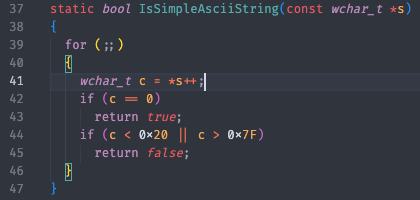
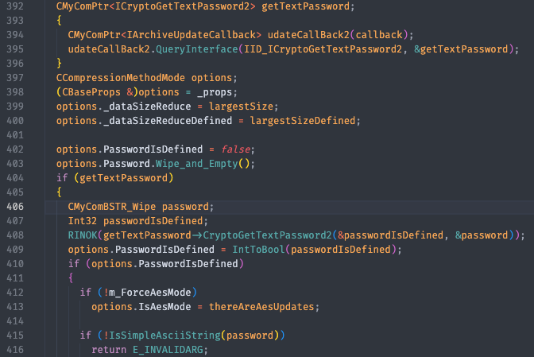

# Checkpoint 2

## Contents:

- [Checkpoint 2](#checkpoint-2)
  - [Contents:](#contents)
  - [Static Analysis](#static-analysis)
  - [Dynamic Analysis](#dynamic-analysis)
    - Generating a corpus
    - Experimenting with fuzzing composition flags
    - Parallel fuzzing
    - Results

\newpage

## Static Analysis

\newpage

## Dynamic Analysis

## Static Analysis

We ran the codebase through the static analysis tool cppcheck, which tagged 1569 warnings and errors. One of the common errors flagged by cppcheck was shiftTooManyBits

Unfortunately, when looking at the actual source code, almost all of these errors come from an innocuous function:

The rest, on closer inspection, are also falsely flagged as errors, such as this one:

A more promising error seems to be a possible null pointer exception:

This function is only called once, in the same file at line 415:

It looks like `password` gets populated in `CryptoGetTexPassword2`, looking at that function, and the subsequent call to StringToBstr, it unfortunately looks like the nullpointer is properly checked for.

