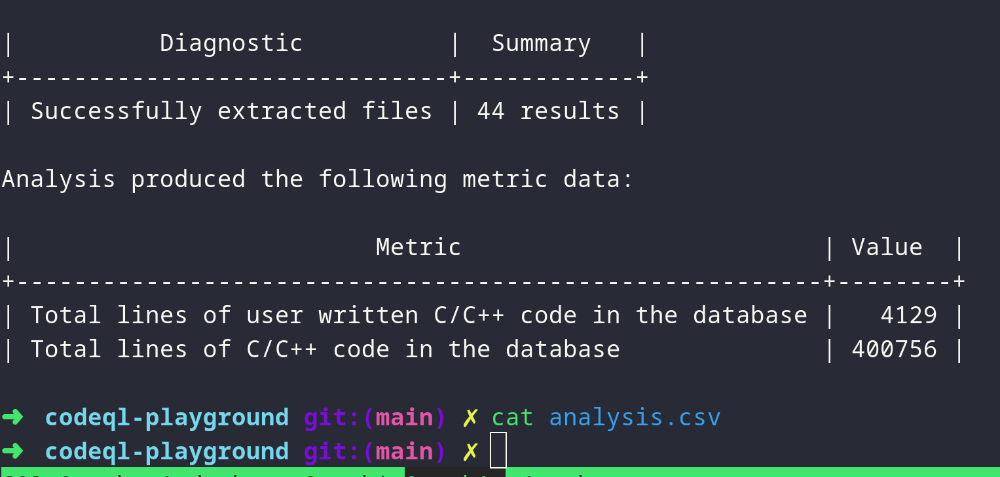
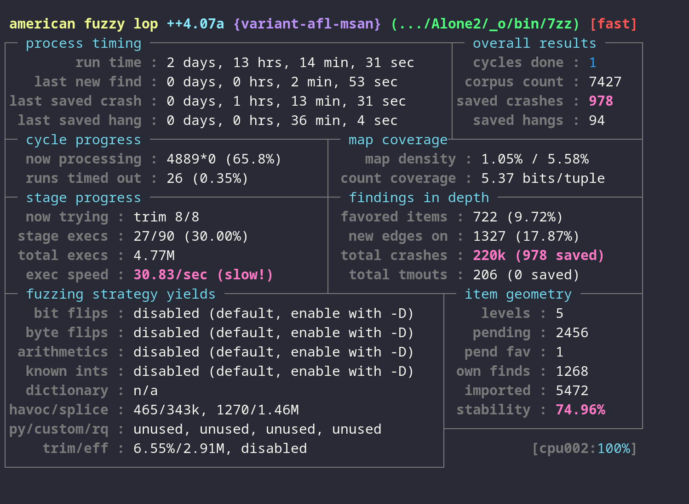

# Checkpoint 2

## Contents:

- [Checkpoint 2](#checkpoint-2)
  - [Contents:](#contents)
  - [Static Analysis](#static-analysis)
  - [Dynamic Analysis](#dynamic-analysis)
    - [Generating a corpus](#generating-a-corpus)
    - [Experimenting with fuzzing composition flags](#experimenting-with-fuzzing-composition-flags)
    - Parallel fuzzing
    - Results

\newpage

## Github Link

[https://github.com/atharvakale343/390r-debugging-setup](https://github.com/atharvakale343/390r-debugging-setup)

## Static Analysis

\newpage

## Dynamic Analysis

## Fuzzing

Fuzzing was the main dynamic analysis technique we used against our target `p7zip`. We mainly fuzzed the extract (`e`) feature of our binary as the feature uses several decompression algorithms as part of its execution.

We used `afl-plus-plus` as the primary fuzzing tool.

[https://github.com/AFLplusplus/AFLplusplus](https://github.com/AFLplusplus/AFLplusplus)

## Generating a corpus

We took a variety of steps to find a good enough corpus for our fuzzing efforts. The major approach here to was to search online for commonly used corpora. Our main goals here was to find not only `.zip` format, but also as many different formats possible.

We found a decent corpus at [https://github.com/strongcourage/fuzzing-corpus](https://github.com/strongcourage/fuzzing-corpus)

This included the following formats:

- `.zip`
- `.gzip`
- `.lrzip`
- `.jar`

We added this as a target to our fuzzing Makefile.

```Makefile
get-inputs:
	rm -rf in_raw fuzzing-corpus && mkdir in_raw

	git clone -n --depth=1 --filter=tree:0 git@github.com:strongcourage/fuzzing-corpus.git
	cd fuzzing-corpus && git sparse-checkout set --no-cone zip gzip/go-fuzz lrzip jar && git checkout
	mv fuzzing-corpus/zip/go-fuzz/* in_raw
	mv fuzzing-corpus/jar/* in_raw
	mv fuzzing-corpus/gzip/go-fuzz/* in_raw
	mv fuzzing-corpus/lrzip/* in_raw
```

The next step was to choose only "interesting" inputs from this corpus. This includes small inputs that don't crash that binary immediately.

We used the `afl-cmin` functionality to minimize the corpus.

```bash
afl-cmin -i in_raw -o in_unique -- $(BIN_AFL) e -y @@
```

Another important minimization step included `tmin`. This augments each input such that it can be as small as possible without compromising it's ability to mutate and produce coverage in the instrumented target.

Unfortunately, this process takes a long time, and it only completed for us after a day.

```bash
cd in_unique; for i in *; do afl-tmin -i "$$i" -o "../in/$$i" -- ../$(BIN_AFL) e -y @@; done
```

The cybersec room servers come in handy here!

## Experimenting with fuzzing composition flags

We discovered that it is not enough to fuzz a plain instrumented target with `afl-plus-plus`. The target binary may not be easily crashed with mutated inputs as `p7zip` has a robust input error checker. We took to fuzzing with various sanitizers instead to search for harder to find bugs.

We used the following sanitizers on our target:

- ASAN: Address Sanitizer: discovers memory error vulnerabilities such as use-after-free, heap/buffer overflows, initialization order bugs etc.

- MSAN: Memory Sanitizer: mainly used to discover reads to uninitialized memory such as structs etc.

- TSAN: Thread Sanitizer: finds race conditions

```Makefile

fuzz-afl:
	AFL_SKIP_CPUFREQ=1 AFL_I_DONT_CARE_ABOUT_MISSING_CRASHES=1 $(AFL_FUZZ) -M main-afl-$(HOSTNAME) -t 30000 -i in -o out -- $(BIN_AFL) e -y @@

fuzz-afl-asan:
	AFL_SKIP_CPUFREQ=1 AFL_I_DONT_CARE_ABOUT_MISSING_CRASHES=1 $(AFL_FUZZ) -S variant-afl-asan -t 30000 -i in -o out -- $(BIN_AFL_ASAN) e -y @@

fuzz-afl-msan:
	AFL_SKIP_CPUFREQ=1 AFL_I_DONT_CARE_ABOUT_MISSING_CRASHES=1 $(AFL_FUZZ) -S variant-afl-msan -t 30000 -i in -o out -- $(BIN_AFL_MSAN) e -y @@

fuzz-afl-tsan:
	AFL_SKIP_CPUFREQ=1 AFL_I_DONT_CARE_ABOUT_MISSING_CRASHES=1 $(AFL_FUZZ) -S variant-afl-tsan -t 30000 -i in -o out -- $(BIN_AFL_TSAN) e -y @@
```







## Static Analysis

We ran the codebase through the static analysis tool cppcheck, which tagged 1569 warnings and errors. One of the common errors flagged by cppcheck was shiftTooManyBits


Unfortunately, when looking at the actual source code, almost all of these errors come from an innocuous function:


The rest, on closer inspection, are also falsely flagged as errors, such as this one:


A more promising error seems to be a possible null pointer exception:


This function is only called once, in the same file at line 415:


It looks like `password` gets populated in `CryptoGetTexPassword2`, looking at that function, and the subsequent call to StringToBstr, it unfortunately looks like the nullpointer is properly checked for.


