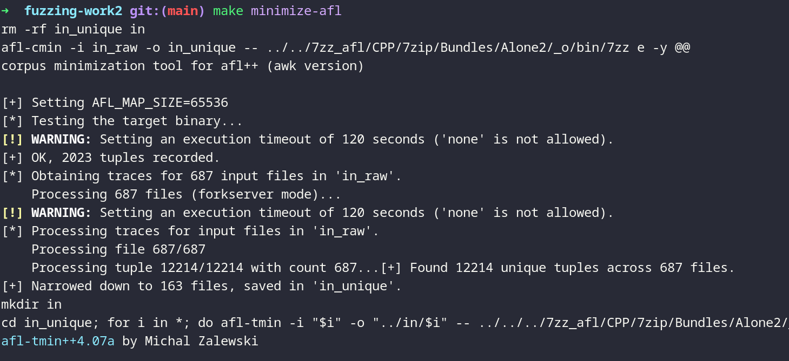
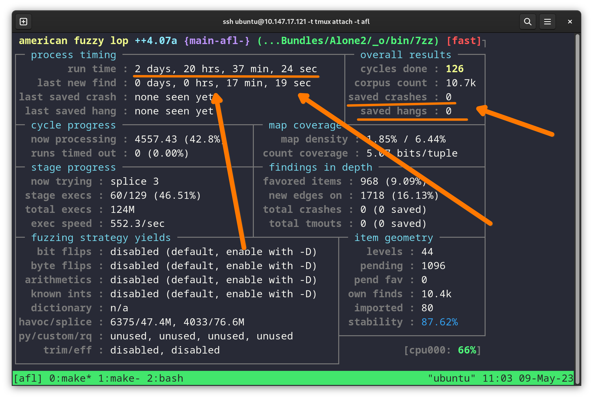
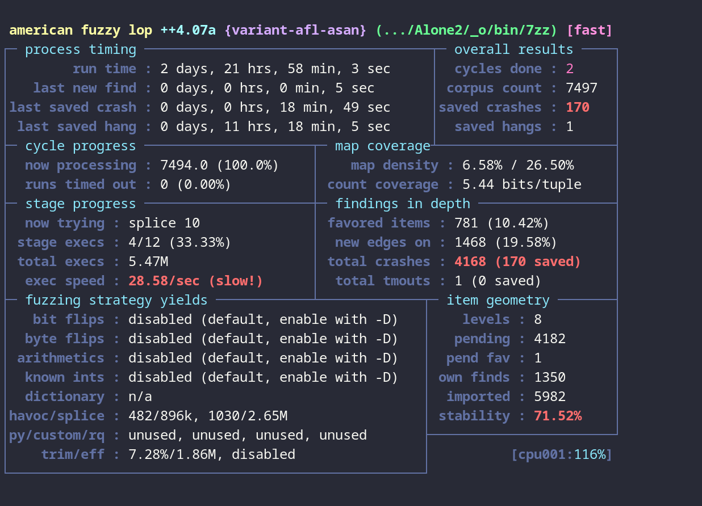
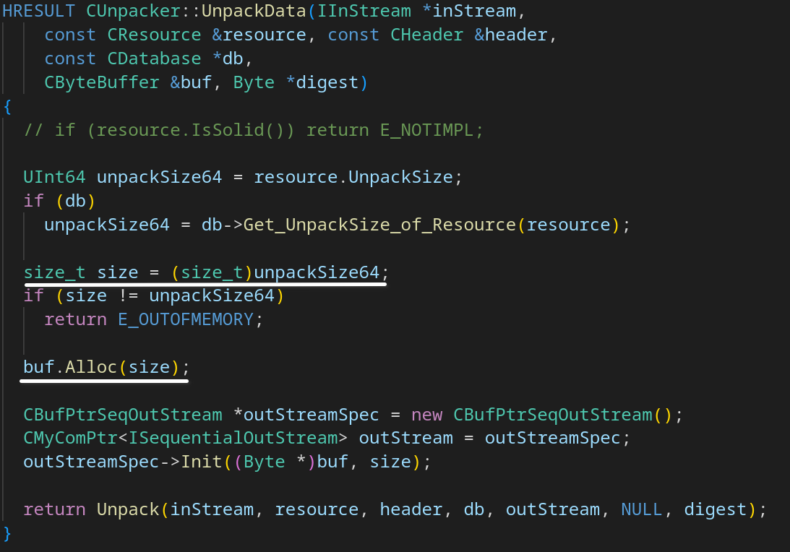

Target Overview

-   p7zip is an open-source POSIX port of the popular Windows utility 7zip
-   Supports extracting and archiving a large number of formats
-   Implements several compression algorithms (codecs)
-   Hosts a CLI frontend
-   Used in almost all GUI ZIP programs in Windows
-   Also includes cryptographic algorithms for archive encryption

Building the Target

-   All our build instructions are in our Github Repo
-   https://github.com/atharvakale343/p7zip-390r

We have a Makefile that supports the following build targets:

-   default (as-is)
-   debug (-g2 -O0 CFLAGS)

AFL Fuzzing Buildings:

-   AFL instrumentation (afl)
-   ASAN
-   MSAN
-   UBSAN
-   CFISAN
-   TSAN

Dynamic Analysis

Fuzzing

-   Fuzzing is a popular technique against binary targets
-   We fuzzed p7zip's extract (e) subcommand
-   afl-plus-plus (https://github.com/AFLplusplus/AFLplusplus)

Generating a corpus

-   Goal: Find a varied corpus that hits several compression formats
-   We found a decent corpus at https://github.com/strongcourage/fuzzing-corpus

Makefile target: get-inputs

Minimizing the Corpus

-   Used tools:
-   afl-cmin
    -   Ensures only "interesting" inputs are considered
-   afl-tmin
    -   Strips the input to make it lightweight
-   We found that these two steps significantly increased coverage of our fuzzing efforts

Makefile target: minimize

Fuzzing Composition Flags

-   Discovered not sufficient to just fuzz a vanilla `afl` binary

(Put red circle emoji)

Fuzzing Composition Flags

-   Looked to several sanitizers to find non-crashing bugs

We used the following sanitizers on our target:

-   ASAN: Address Sanitizer: discovers memory error vulnerabilities such as use-after-free,
    heap/buffer overflows, initialization order bugs etc.
-   MSAN: Memory Sanitizer: mainly used to discover reads to uninitialized memory such as structs
    etc.
-   TSAN: Thread Sanitizer: finds race conditions

Makefile target: fuzz-afl-<sanitizer>

Parallel Fuzzing

-   Discovered it is efficient to have one fuzzer running of each type
-   Set up a main fuzzer with several service fuzzing
-   All fuzzers share same output dictionaries

(Cybersec room servers ftw)

Potential Bugs Discovered

-   "Can't allocate required memory error" due to malloc called with a huge size argument.

-   The size argument is passed into new => malloc

-   This argument is contained within some offset of the header
-   Potential bug if we can find arithmetic operations used with malloc arguments using static analysis. Then we can perform malloc overflow by setting the size with the header bytes.

