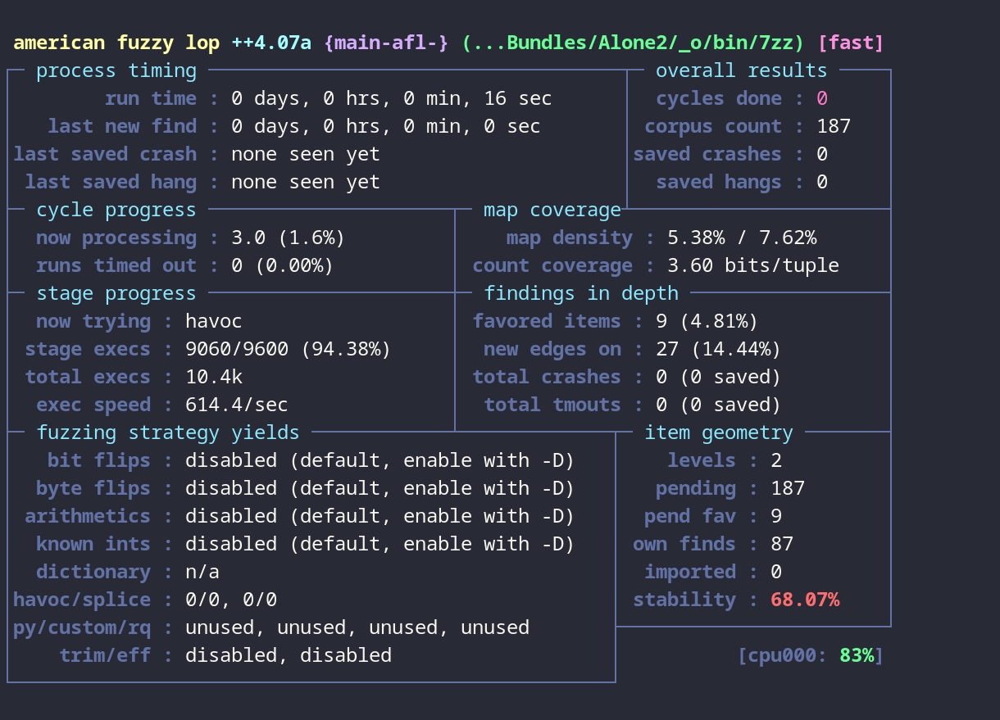
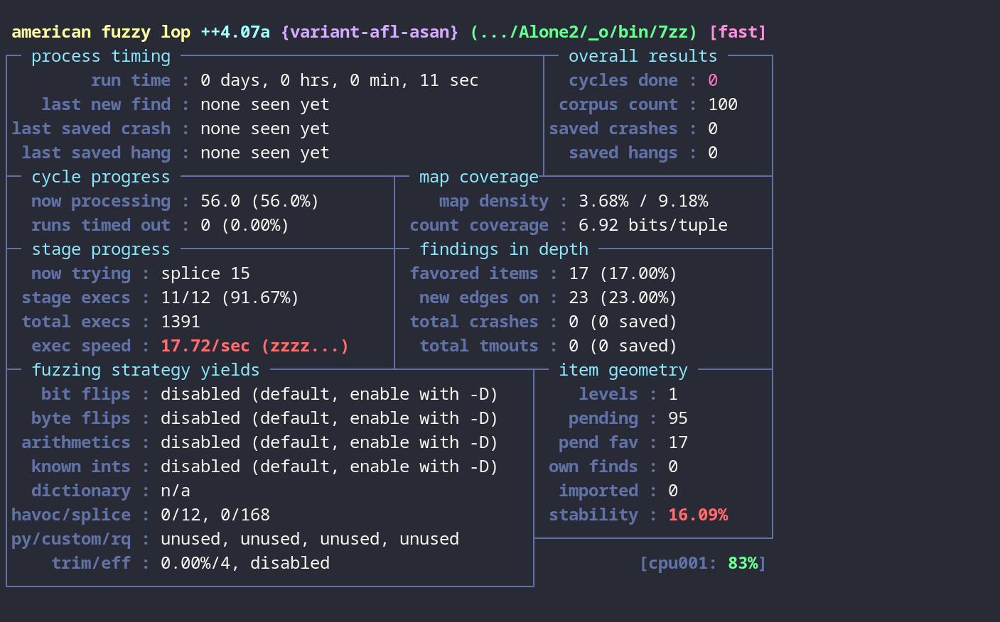
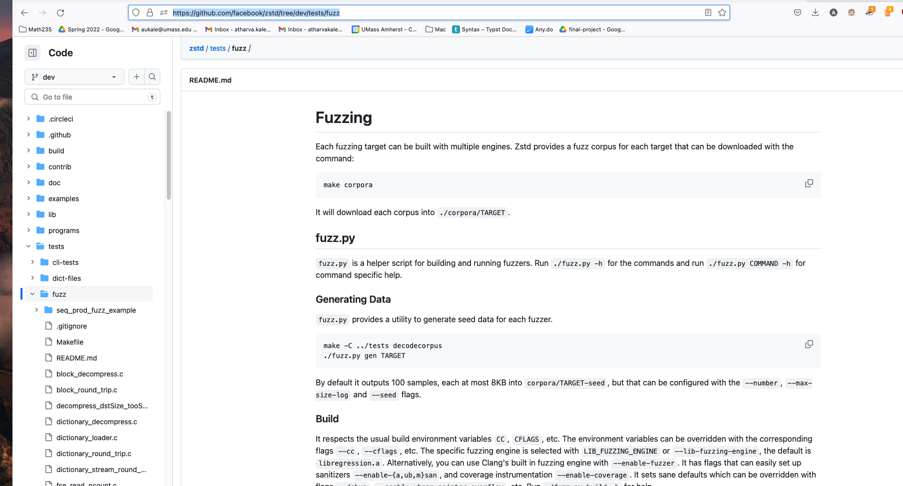
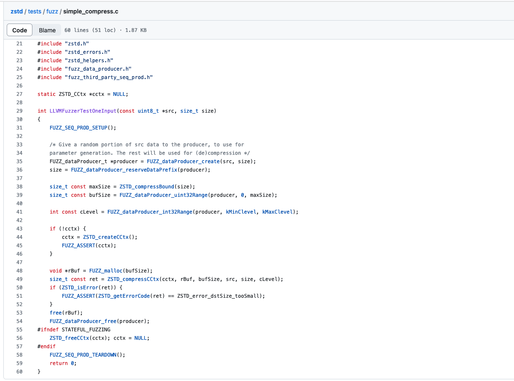

# Final Writeup

Public Github Repository - This should include all code you wrote for eg. static analysis, fuzzing harnesses, etc. If you built your target with instrumentation for the purposes of fuzzing, this should also include build scripts. If you performed reverse engineering on your target and eg. started renaming variables/functions/did work on that front, include the relevant ghidra files as well.

Start your writeup with a description of what you learned about this target. This should include some notes about the code layout, maybe some coding practices you noticed while going through the target or just more general functionality. Which parts of the target did you think were most interesting for the purposes of finding bugs?

Describe what you chose for your automated analysis portion and why. How did you set this up, did you encounter issues (eg. slow fuzzer performance), and if so what did you to improve on these issues.

What were the biggest challenges you faced when dealing with your target?

If given more time, what do you think would be good next steps to continue doing research on the target with the goal of finding bugs?

## Contents:

-   [Final Writeup](#final-writeup)
    -   [Contents:](#contents)
    -   [Github Link](#github-link)
    -   [Overview of the Target](#overview-of-the-target)
        -   [Code Layout](#code-layout)
        -   [Coding Observations](#coding-observations)
        -   [Target Features](#target-features)
    -   [Automated Analysis](#automated-analysis)
        -   [Fuzzing](#fuzzing)
        -   [Generating a corpus](#generating-a-corpus)
        -   [Experimenting with fuzzing composition flags](#experimenting-with-fuzzing-composition-flags)
        -   [Extract command](#extract-command)
        -   [Parallel Fuzzing](#parallel-fuzzing)
        -   [Extract Fuzzing Results](#extract-fuzzing-results)
        -   [Archive command](#archive-command)
        -   [Harness](#harness)
        -   [Archive Fuzzing Results](#archive-fuzzing-results)
        -   [OSS-Fuzz and State of Fuzzing `p7zip`](#oss-fuzz-and-state-of-fuzzing-p7zip)
    -   [Static Analysis](#static-analysis)
        -   [CppCheck](#cppcheck)
        -   [CodeQL](#codeql)
        -   [FlawFinder](#flawfinder)
    -   [Challenges Faced](#challenges-faced)
        -   [Working with a large C/C++ codebase](#working-with-a-large-cc-codebase)
        -   [Bug Hunting False Positives](#bug-hunting-false-positives)
    -   [Next Steps](#next-steps)

\newpage

## Github Link

[https://github.com/atharvakale343/p7zip-390r](https://github.com/atharvakale343/p7zip-390r)

\newpage

## Overview of the Target

**p7zip** is a fully compliant linux port of the open source _7zip_ tool for Windows. It is a utility used to archive and extract various compression formats. It is primarily used in Windows GUI tools as an underlying utility to support their file compression features.

_p7zip_ provides the following features:

1. Several compression algorithms (_lz4_, _zstd_, _Lizard_, etc...)
2. CLI frontend
3. Cryptographic algorithms for
   Home
   Exp archive encryption (_SHA256_, _AES_, _RAR5_, etc...)

\newpage

### Code Layout


### Coding Observations

TODO

### Target Features

The main features of `7zz` is to extract from different compression formats and archive a collection of files. We decided to focus mainly on the `extract` or **e** command which accepts a compressed file and extracts its contents to the current directory.

We also looked into the `archive` or **a** command that compresses a list of files into a `.7z` file. This uses various compression algorithms such as LZ4, Brotli, Lizard, etc.

## Automated Analysis

### Fuzzing

Fuzzing was the main dynamic analysis technique we used against our target `p7zip`. We mainly fuzzed the extract (`e`) feature of our binary as the feature uses several decompression algorithms as part of its execution.

We used `afl-plus-plus` as the primary fuzzing tool.

[https://github.com/AFLplusplus/AFLplusplus](https://github.com/AFLplusplus/AFLplusplus)

### Generating a corpus

We took a variety of steps to find a good enough corpus for our fuzzing efforts. The major approach here to was to search online for commonly used corpora. We wanted to find not only `.zip` format, but also as many different formats possible.

We found a decent corpus at [https://github.com/strongcourage/fuzzing-corpus](https://github.com/strongcourage/fuzzing-corpus)

This included the following formats:

-   `.zip`
-   `.gzip`
-   `.lrzip`
-   `.jar`

We added this as a target to our fuzzing Makefile.

```Makefile
get-inputs:
	rm -rf in_raw fuzzing-corpus && mkdir in_raw

	git clone -n --depth=1 --filter=tree:0 git@github.com:strongcourage/fuzzing-corpus.git
	cd fuzzing-corpus && git sparse-checkout set --no-cone zip gzip/go-fuzz lrzip jar && git checkout
	mv fuzzing-corpus/zip/go-fuzz/* in_raw
	mv fuzzing-corpus/jar/* in_raw
	mv fuzzing-corpus/gzip/go-fuzz/* in_raw
	mv fuzzing-corpus/lrzip/* in_raw
```

The next step was to choose only "interesting" inputs from this corpus. This includes small inputs that don't crash that binary immediately.

We used the `afl-cmin` functionality to minimize the corpus.

```bash
afl-cmin -i in_raw -o in_unique -- $(BIN_AFL) e -y @@
```

Another important minimization step included `tmin`. This augments each input such that it can be as small as possible without compromising it's ability to mutate and produce coverage in the instrumented target.

Unfortunately, this process takes a long time, and it only completed for us after a day.

```bash
cd in_unique; for i in *; do afl-tmin -i "$$i" -o "../in/$$i" -- ../$(BIN_AFL) e -y @@; done
```

The cybersec room servers come in handy here!

### Experimenting with fuzzing composition flags

We discovered that it is not enough to fuzz a plain instrumented target with `afl-plus-plus`. The target binary may not be easily crashed with mutated inputs as `p7zip` has a robust input error checker. We took to fuzzing with various sanitizers instead to search for harder to find bugs.

We used the following sanitizers on our target:

-   ASAN: Address Sanitizer: discovers memory error vulnerabilities such as use-after-free, heap/buffer overflows, initialization order bugs etc.

-   MSAN: Memory Sanitizer: mainly used to discover reads to uninitialized memory such as structs etc.

-   TSAN: Thread Sanitizer: finds race conditions

```Makefile
afl:
	rm -rf $(BIN_AFL)
	git clone $(GH_URL) $(BIN_AFL)
	cp 7zz-makefiles/$(BIN_DEFAULT).mak $(BIN_AFL)/CPP/7zip/7zip_gcc.mak
	cd $(BIN_AFL)/CPP/7zip/Bundles/Alone2 && CC=$(AFL_CC) CXX=$(AFL_CXX) make -f makefile.gcc

afl-asan:
	rm -rf $(BIN_AFL_ASAN)
	git clone $(GH_URL) $(BIN_AFL_ASAN)
	cp 7zz-makefiles/$(BIN_AFL_ASAN).mak $(BIN_AFL_ASAN)/CPP/7zip/7zip_gcc.mak
	cd $(BIN_AFL_ASAN)/CPP/7zip/Bundles/Alone2 && AFL_USE_ASAN=1 CC=$(AFL_CC) CXX=$(AFL_CXX) make -f makefile.gcc

afl-msan:
	rm -rf $(BIN_AFL_MSAN)
	git clone $(GH_URL) $(BIN_AFL_MSAN)
	cp 7zz-makefiles/$(BIN_AFL_MSAN).mak $(BIN_AFL_MSAN)/CPP/7zip/7zip_gcc.mak
	cd $(BIN_AFL_MSAN)/CPP/7zip/Bundles/Alone2 && AFL_CC_COMPILER=LLVM AFL_USE_MSAN=1 CC=$(AFL_CC) CXX=$(AFL_CXX) make -f makefile.gcc

afl-tsan:
	rm -rf $(BIN_AFL_TSAN)
	git clone $(GH_URL) $(BIN_AFL_TSAN)
	cp 7zz-makefiles/$(BIN_AFL_TSAN).mak $(BIN_AFL_TSAN)/CPP/7zip/7zip_gcc.mak
	cd $(BIN_AFL_TSAN)/CPP/7zip/Bundles/Alone2 && AFL_USE_TSAN=1 CC=$(AFL_CC) CXX=$(AFL_CXX) make -f makefile.gcc
```

### Extract command

### Parallel Fuzzing

To start with, our approach was to fuzz the `extract` command of `7zz`. So we found an appropriate corpus and fuzzed with the `e` command-line argument (along with `-y` to account for same filenames / avoid user input hangs).

With all different sets of compilation flags that we mentioned previously, we compiled the binaries with AFL instrumentation. Then, to more effectively fuzz, we setup a parallel fuzzing environment in one of the **CyberSec club** VMs.

We added the `afl-fuzz` commands in a `Makefile` and followed the official [guide](https://github.com/AFLplusplus/AFLplusplus/blob/stable/docs/fuzzing_in_depth.md#c-using-multiple-cores) for using multiple cores. Below are the commands we utilized. All of our fuzzers shared the same input and output directores to keep track of current fuzzing state.

```bash
AFL_SKIP_CPUFREQ=1 AFL_I_DONT_CARE_ABOUT_MISSING_CRASHES=1 $(AFL_FUZZ) -M main-afl-$(HOSTNAME) -t 2000 -i in -o out -- $(BIN_AFL) e -y @@
```

Our main fuzzer used a regular instrumented AFL binary with no other `CFLAGS`. We used a timeout of 30 seconds to denote a hang (or infinite loops).

```bash
AFL_SKIP_CPUFREQ=1 AFL_I_DONT_CARE_ABOUT_MISSING_CRASHES=1 $(AFL_FUZZ) -S variant-afl-asan -t 2000 -i in -o out -- $(BIN_AFL_ASAN) e -y @@
```

Our variant fuzzers utilized binaries compiled with other flags (such as _asan_ and _msan_). These had the same timeout as before of 30 seconds.

To keep track of all fuzzers and run them simultaneouly, we used `tmux` sessions with a separate window for each fuzzer.

\newpage

### Extract Fuzzing Results

We ran the fuzzers using multiple cores for around 5 days. We noticed no crashes in most of the variants, with ASAN being the exception. However, some fuzzers encountered hangs.

{width=400}

{width=400}

We tried running an input from `in/hangs` to check where an infinite loop could occur. But, all inputs eventually terminated while taking longer than 30 seconds. Therefore, we concluded that these executions were incorrectly flagged as hangs due to large size of the file. We could possibly set the timeout even higher to avoid this issue.

**Analyzing asan crashes**


Upon executing the ASAN compiled binary on one of the crash inputs, we found that it occured due to "request allocation size exceeding maximum supported size". This likely occured due to malloc being called with a huge size argument and returning `NULL`.


The crash occurs at the `buf.Alloc` call, which executes a C++ `new` operation that internally calls `malloc`. Here, an argument of `unpackSize64` is passed into the function.


As shown above, the `unpackSize64` argument is a large unsigned integer, so `malloc` fails to allocate this memory and ASAN instigates a crash. If we can control this size argument, this could be a potential bug.


We analyzed the input file in more detail and found `unpackSize64` (in little endian) within the header of the file. So we can attempt to modify this offset within the header and control the amount of memory malloc'd. But, this is not an outright segfault since CPP error handling accounts for this and throws an exception, which is caught by the `p7zip` error handler.

However, this is a potential bug if combined with static/taint analysis so see if we could perform a possible overflow due to some arithmetic operations performed on this size argument.

### Archive command

We also fuzzed the `archive` command of `7zz`. For this, we initially chose a corpus of _.txt_ files, fuzzing the `a` command-line argument (along with `-y` to avoid user input hangs). But, we could not directly fuzz this since `afl-fuzz` only supports one cli argument and `a` can be used with multiple files with the following syntax:

```bash
7zz a files.zip file1.txt file2.txt file3.txt
```

We concluded that it would not be sufficient to just archive one file so we decided to create a harness which would allow for multiple file as arguments.

### Harness

Our approach for the harness is as follows:

-   As `afl-fuzz` allows for only one input to the target binary, our harness would accept one file name as argument.
-   Contents of this input file would be divided into chunks of $1000$ bytes and one new file will be created for each chunk.
-   With a maximum limit of $15$ files, these set of created files would be passed in as arguments to `7zz`.

We created a new _MainAr.cpp_ with the `main` function being replaced by our harness which would mutate the input and pass it into _argv_ of `main_7zz`, the original `main` function of p7zip. This way, we can fuzz the archive command with multiple files and potentially discover more bugs.

```bash
AFL_SKIP_CPUFREQ=1 AFL_I_DONT_CARE_ABOUT_MISSING_CRASHES=1 $(AFL_FUZZ) -M main-afl-$(HOSTNAME) -t 30000 -i in -o out -- $(BIN_AFL_HARNESS) @@
```

Our `afl-fuzz` command just passes in a cli argument to the harness.

### Archive Fuzzing Results

We also ran these fuzzers using multiple cores, but for a shorter timeframe of around 2 days. We did not notice any crashes or hangs in any of the fuzzers. Also, we were not able to observe the fuzzers for a longer duration and record more insights as the cybersec room servers had been shut down.





\newpage

### OSS-Fuzz and State of Fuzzing `p7zip`

When we were researching good ways to fuzz `p7zip`, we found a [pull request](https://github.com/google/oss-fuzz/pull/5899) on the repository that asks the maintainer if they would like `p7zip` to be part of a wider fuzzing initiative by Google called [OSSFuzz](https://github.com/google/oss-fuzz) which fuzzes popular open-source projects for free. Although this pull request was never merged, it hinted to us that it was possible that some organizations are fuzzing this project regularly.

Interestingly, we also found that the repository itself has a fuzzer set up for some of its codecs (compression algorithms).

For example, we found a dependency [zstd](https://github.com/facebook/zstd/tree/dev/tests/fuzz), which is a real-time compression library build by Meta. This has a fuzzing subdirectory set up for fuzzing this library.



We found that they are using [libFuzzer](https://llvm.org/docs/LibFuzzer.html), a coverage guided fuzzing library by LLVM. They also use AFL in tandem with their setup.

We found really interesting design choices in their fuzzing setup. One such choice was to incorporate unit-fuzzing, which is fuzzing small features of the target.

This was evident in a **simple LLVM harness** they wrote:



In this harness, they first produce an input using the libFuzzer's input generator. They then call into the function they are fuzzing-`ZSTD_compressCCtx`.


This seems to be a major function in their library that handles compression of certain input frames.

These more advanced approaches seem more well suited to a project of this size, as fuzzing with a small harness may provide a higher exec speed.

## Static Analysis

We used three main tools for static analysis: CppCheck, CodeQl, and Flawfinder.

-   CppCheck relies on multiple integrated tools for analyzing source; focuses on detecting undefined behavior

-   CodeQL abstracts the source to a QL-language IR, which can then be queried

-   Flawfinder is a syntatic analysis engine that scans for vulnerable code patterns

We used three seperate tools because static analysis tools are significantly more effective at finding vulnerabilities when combined\*

*CPPCheck/Flawfinder* in particular when run alone struggle to identify vulnerabilities, according to Lip et al. 2022 empirical study (preprint)

### CppCheck

CppCheck tagged a large number of errors, but most were false positives.

One such error reported undefined bit shifting:


But this was just due to an innocuous macro:


More promising was a potential null pointer bug:


But this was checked for in the source:


### CodeQL

CodeQL creates a database from source, which can be queried for dataflow analysis.

Running it against the default CPP queries produced nothing interesting:


However, tracking the basic dataflow into the `alloc()` sink by writing a query we were able to pin down the source of the bug that triggered the program crash (invalid size passed to the `new` operator):


The `XMLResource` element is part of the header field of the file, which can theoretically be controlled. However, as noted, this triggers CPP error handling so is not a serious bug.

### FlawFinder

FlawFinder is a purely syntactical engine, which means it doesn't do any control flow, data flow, etc. analysis. It simply scans for vulnerable code patterns.

As such, most warnings are not going to be particularly interesting:


However, there was one particular flag that caught our eyes, and it had to do with a specific use of `strcpy()` in WimHandler.cpp:


It was stated in the presentation that this was a potential segfault/buffer overflow. This was not correct, as `method` is cast as `unsigned`, and as such there is no risk of overflow with this specific `strcpy`.

Method is a part of the WIM file header and is derived from the compression flags. It would be interesting if this was the source of a bug, but alas.

We examined the `ConvertUInt32ToString()` function as well, just in case, but it appears to be robust.

## Challenges Faced

### Working with a large C/C++ codebase

It was our first exposure to working with a large C/C++ codebase. Although neatly organized at first glance, the project quickly turned into a codebase with a bunch of build scripts. Our first challenge was to figure out how to get a debug and release build going. Documentation on the dependencies was sparse, so this involved a compile-and-fail cycle to find all the dependencies for our systems. However, this experience provided us with great insight on how real world C++ projects are build, and gave us some direction on how to design such a codebase for a project in the future.

### Bug Hunting False Positives

Another challenge for this target had to do with the static analysis portion. We ran our target through three utilities, and in total there were thousands of reported errors/warnings. Given the size and complexity of the codebase, bug hunting false positives was a chore.

## Next Steps

-   We noticed slow fuzzing especially with the `harness` so _Snapshot fuzzing_ could help in making the process more effective and gain more coverage.
-   Writing more in depth queries in CodeQL to perform more comprehensive control-flow analysis.
-   Perform _Data Flow Analysis_ in tandem with simpler syntactic analysis tools/dynamic analysis using CodeQL or similar.
-   Delve into the compile process in order to emit LLVM bitcode and consequently the IR so we can write passes on the target.
-   Find more corpora for the `archive` command as only _.txt_ files might not be enough to discover bugs.
-   Set up variant analysis based on other commonly found bugs in open-source projects.
